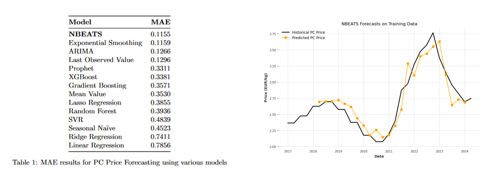

# Data Scientist

**About Me**
------------

I gratuated from [McGill University](https://www.mcgill.ca/desautels/about/about-desautels/rankings) in December 2022 with a degree in [Mathematics](https://www.mcgill.ca/study/2024-2025/faculties/desautels/undergraduate/programs/bachelor-commerce-bcom-major-mathematics-and-statistics-management) and [Business Analytics](https://www.mcgill.ca/study/2024-2025/faculties/desautels/undergraduate/programs/bachelor-commerce-bcom-concentration-business-analytics). I am now continuing to improve my skills at Ecole Polytechnique and HEC Paris with a [master's degree in data science](https://programmes.polytechnique.edu/en/master/programs/data-science-for-business-joint-degree-with-hec). I aspire to use my knowledge and expertise to provide data-driven solutions for better business decisions. In addition to my passion of data science, I enjoy playing tennis 🎾 and composing music 🎵. I am always willing to learn new traits.

**Education**
------------

* **Master of Science in Data Science & AI for Business**, École Polytechnique / HEC Paris (2023-2025)
	+ GPA: 3.9/4.0
	+ Courses (X): Python for Data Science, Statistics, Machine Learning, Deep Learning, Database Management, NLP
	+ Courses (HEC): Tableau, Fairness & Interpretability, MLOps, Time Series, Causal Inference, Reinforcement Learning

* **Bachelor of Commerce**, McGill University (2019-2022)
	+ Major in Mathematics, Concentration in Business Analytics
	+ McGill One-Year Entrance Scholarship (2019)
	+ Courses: Algebra, Calculus, Optimization, Operations Management, Operations Research, Data Analytics

**Professional Experience**
-------------------------

### **NielsenIQ Digital Purchases (formerly Foxintelligence)** (April-August 2024)

I joined the data science team to improve the performance of a product categorization model which relied solely on product names. My contribution was implementing a flexible Multimodal Transformer model to integrate textual, numerical, and categorical features, improving product classification accuracy by 2%, just by adding product prices.

---

### **BCG-X Data Challenge - Customer Churn Prediction & AI Strategy Development** (February 2025) 

I collaborated with strategic management students to identify and prioritize 10 AI-driven data use cases for a B2B construction products distributor, selecting churn prediction as the most valuable using an Impact-Feasibility Matrix. A Logistic Regression model was developed, achieving 96% precision and 77% recall in identifying at-risk customers. 

---

### **L’Oreal Data Challenge – Marketing Mix Modeling** (February 2025)

This project used Google Meridian for marketing mix modeling, analyzing $10M+ in A&P investments by L'Oreal to measure their impact on sales from 2022 to 2024(R² = 0.81). We assessed ROI across 20 marketing channels, uncovering trends and optimizing budget allocation using response curves.

---

### **Eleven Strategy Data Challenge - AI-Driven Client Selection for Luxury Events** (January 2025) 

* Designed a commercial proposal of an AI-driven client selection model within one week, leveraging 3 datasets to optimize luxury event marketing strategies.
* Leveraged a 50K+ transaction dataset to measure the causal impact of event invitations on revenue by comparing pre-event and post-event client spendings.
* Achieved 92% accuracy in predicting event attendance probability with a Logistic Regression model, enhancing invitation precision.
* Developed an interactive Streamlit app that enables marketing teams to generate a list of high-potential clients to invite, improving event attendance efficiency.

---

### **Unibail-Rodamco-Westfield - Retail Performance & Mix Optimization** (January 2025) 

* Integrated 6 diverse datasets (sales, costs, traffic) at store and mall levels, creating a unified dataset with over 15,000 rows to support comprehensive analysis.
* Developed 6 KPIs focused on revenue, cost efficiency, and traffic flow, enabling precise evaluation of store and mall performance to uncover inefficiencies.
* Leveraged hierarchical clustering to categorize malls into 4 distinct segments (luxury, fashion, convenient, family-friendly) and tailored strategic recommendations accordingly.
* Collaborated with a team of 6 to present insights to URW managers, earning recognition as one of the top 2 teams out of 10 for delivering highly actionable recommendations.

---

### **Schneider Electric - Plastic Cost Prediction** (December 2024)

* Designed data preprocessing pipelines, merging over 10 datasets and ensuring consistency through timestamp alignment, format unification, and missing value imputation, obtaining quarterly data from 2017 to 2024.
* Implemented and evaluated forecasting models to forecast Polycarbonate and Green Polycarbonate prices for the first 3 quarters of 2025, with Deep Learning model achieving the best performance with a Mean Absolute Error of 0.115.
* Delivered strategic business insights by correlating cost forecasts with Schneider Electric’s pricing and competitor data, enabling informed procurement and pricing decisions.
* Collaborated with a cross-functional team of five members to create a state-of-the-art solution, recognized as the best-performing team among 6 competing groups, for developing data-driven solutions that aligned with Schneider Electric’s sustainability and profitability objectives.

---

### **Capgemini Invent - Air Quality in Paris Time Series Forecasting**	(October 2024)

* Performed data preprocessing for time series forecasting, including the integration of 3 external sources (weather, holidays, covid-19 periods) to improve model relevance, as well as the handling of missing and outlier data via Qolmat's analysis tools, guaranteeing data integrity and continuity.
* Trained and evaluated multiple forecasting models using Darts to predict hourly concentrations of five key pollutants over a three-week period using historical data from 2020 to 2024.
* Implemented a hybrid ensemble model combining LightGBM and CatBoost, achieving our best Mean Absolute Error of 5.74, reaching top 3 ranking on Kaggle’s leaderboard.

### **Capgemini Invent - Customer Feedback Analysis for TotalEnergies** (January-March 2024) 

* Developed an automated solution to scrape over 200 pages of customer reviews from Trustpilot using Selenium to analyze the Voice of Customer.
* Leveraged BERTopic to analyze over 10,000 customer interactions, uncovering key topics and pain points across entire customer journey for TotalEnergies and its main competitors.
* Collaborated with a team of six students to present findings to a panel of data science consultants, communicating data-driven insights on customer sentiment.

**Projects**
-------------------------

### **Manga Recommender System** (March 2025)
[GitHub Repo](https://github.com/Trung-Dan-Phan/manga_recommender_system)

* Designed and deployed a collaborative filtering-based recommender system using data from 10,000+ manga titles and 10,000+ user profiles collected via the Anilist API and stored on Google BigQuery
* Evaluated 10 models using scikit-surprise; best model (SVD) achieved MAE of 0.637 and Precision@10 of 0.981 improving recommendation precision by 3.7% over baseline popularity-based methods.
* Built a Prefect-driven ML pipeline for automated daily data fetching and weekly model training, achieving an end-to-end runtime of <15 minutes.
* Integrated CI/CD with GitHub Actions and pre-commit hooks to automate testing and deployment, maintaining robust code quality and applying MLOps best practices.

**Skills**
------------------------------
- **Languages & Databases:** Python, SQL, Git, GCP (BigQuery), AWS (S3)
- **Data Visualization:** Matplotlib, Seaborn, Plotly, Tableau
- **Machine Learning:** Numpy, Pandas, Scipy, Statsmodels, Scikit-learn, PySpark, TensorFlow, PyTorch, Keras, spaCy
- **AI Models:** Supervised Learning, Unsupervised Learning, Natural Language Processing, Deep Learning, Time Series, Causal Inference, Marketing Mix Modeling, Reinforcement Learning
- **MLOPS:** Mlflow, Docker, FastAPI, Prophet

**Interests**
------------------------------

* Tennis (15+ years)
* Clarinet (15+ years)
* Music production (SoundCloud)
* Traveling
